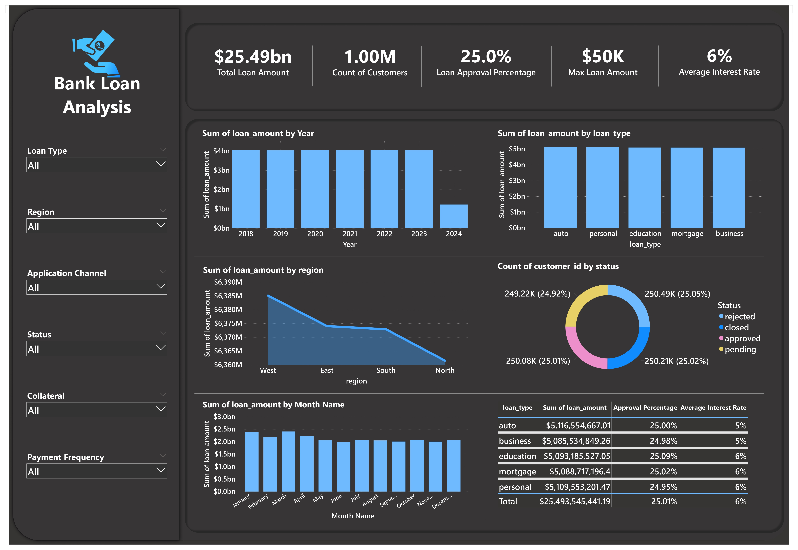

## 📊 Bank_loan Analysis (2018-2024)
  This project performs data exploration and analysis on loan data to understand risk levels, default patterns, and lending trends. It’s part of my data analyst learning path using SQL, Excel, and Power BI.

## 📝 Table of Contents

- [📄 Project Overview](#-project-overview)
- [📦 Dataset](#-dataset)
- [🎯 Objectives](#-objectives)
- [🔍 Deep-Dive Insights](#-deep-dive-insights)
- [🧮 SQL Concepts You Used](#-sql-concepts-you-used)
- [📊 Dashboard](#-dashboard)
- [🛠 How to Use](#-how-to-use)
- [🧰 Tools & Technologies](#-tools--technologies)

## 📄 Project Overview

  This project involves analyzing a dataset containing 1 million rows of bank loan data from 2018 to 2024. The goal is to understand customer loan behavior, identify loan distribution patterns across different seasons, and evaluate the types of collateral used. The analysis provides deep insights into risk assessment and helps inform strategic business decisions.

## 📦 Dataset 

 The dataset Bank_loan was generated using ChatGPT to simulate real-world banking scenarios.

**Source**: ChatGPT (attached with this repository)

**Volume**: 1M rows with 12 columns

**Format**: CSV

**Key Columns**:

  * Customer_Id: Unique ID per customer

  * Officer_Id: Bank officer responsible for the loan

  * Loan_Amount: Principal amount

  * Interest_Rate: Applied interest rate

  * Term_Months: Loan duration in months

  * Start_Date: Date of issue

  * Status: Loan status (e.g., approved, rejected)

  * Loan_Type: Type of loan (e.g., personal, mortgage)

  * Payment_Frequency: Monthly or quarterly payments

  * Collateral: Asset used to secure the loan

  * Application_Channel: Application method (e.g., online, agent)

  * Region: Customer’s geographical region

     

## 🎯 Objectives

  * Identify top 5 loan officers by total provided loan amount.

  * Analyze Month-Over-Month loan growth.

  * Calculate average loan amount by collateral type.

  * Calculate total loan amount by application channel per region.

  * Calculate yearly average loan amount per loan type.

  * Compare each customer’s loan to their average loan amount.

## 🔍 Deep-Dive Insights

  This report provides an in-depth analysis of our loan performance, ideal customer profile, and regional performance. By integrating these insights, we can pinpoint areas of success and identify regions requiring targeted improvements.
  
  Across the years 2018 to 2024, Customers took out a total of $25.49 billion in loans from the bank, representing an average loan amount of $26,000 with a 6% average interest rate.

**📈 Sum of Loan Amount by Year:**

**Insights:** . 

* Loan disbursements remained consistently high (~$4 billion/year) stable lending performance (2018–2023).

* Indicates strong credit demand and well-functioning lending operations.

* Loan amount in 2024 dropped by over 70% compared to prior years.

* Partial year data (e.g., only Jan–Mar)

**Action:** 

* Continue to handle increased demand and to achieve target high.

* Compare 2024’s approval and rejection rates with previous years to understand performance shifts.

     

**📈 Sum of Loan Amount by Region:**

**Insights:**

  * All regions are performing closely in terms of total loan disbursement (Range: $6.36bn – $6.39bn).

  * Indicates well-balanced regional lending across the country.

  * Loan amount by regions:

    **North**: A loan amount totaling $6.36 billion was bought by customers from the bank in this northern region.

    **South**: A loan amount totaling $6.37 billion was bought by customers from the bank in this southern region.

    **West** : A loan amount totaling $6.39 billion was bought by customers from the bank in this western region.

    **East** : A loan amount totaling $6.37 billion was bought by customers from the bank in this eastern region.

**Action:** 

Analyze by region :

 * Approval rates
   
 * Customer demographics

 * Loan types and collateral preferences

     

**✅ Balanced Distribution Across Loan Types**

**Insights:**

  * Loan types—auto, business, education, mortgage, and personal—show closely distributed total amounts (between $5.08B and $5.12B), indicating balanced product interest.

  * Average Interest rate is 6% across all loan types except education.

  * Highest approval percentage (25.09%) and only category with a slightly higher average interest rate (6%).

**Action:**

  * Revisit collateral or document requirements

  * Analyze rejection reasons by loan type

     

## 🧮 SQL Concepts You Used

👉 [Download bank_loan_MySQL.sql](bank_loan_MySQL.sql)

  

**📊 Data Exploration & Aggregation** : COUNT(*), SUM(), AVG(), MIN(), MAX(), GROUP BY, HAVING, ORDER BY, LIMIT

**📊 Windows Functions** : RANK(), DENSE_RANK(), PERCENT_RANK(), LAG(), SUM() OVER

**📊 CTEs (Common Table Expressions)** : WITH .... AS ()

**💾 Stored Procedures** : 
 
   

* Reusable blocks for region, Payment_frequency, status, and loan-type-based summaries.

* Helps in data extraction to store what we want.

**🧩 Views** :

   

* Created reusable datasets: North, quarterly, unsecured.

* Clean way to isolate and reuse filtered data subsets.

**🚀 Indexing** :

   

* Indexed on application_channel to optimize filtering.

## 📊 Dashboard

👉 [Download loan.pbix](loan.pbix)

## 🛠 How to Use

1. Clone this repository.

2. Open SQL files in your preferred client (MySQL Workbench, etc,.)

3. Run queries on the provided dataset.

4. (Optional) Open the Power BI file to explore the dashboard.

## 🧰 Tools & Technologies

**MS Excel**: For Data cleaning (null removal, de-duplication)
 
 **MySQL**: For Data Modeling, Transformation, Complex Querying and Analysis of bank loan.

**Power Bi**: For Dashboard and data visualization

