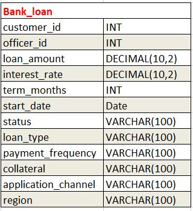
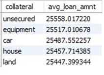

## Bank_loan Analysis
  This project involves the analysis of a dataset containing 1 million rows of bank loan data, across the years 2018-2024. This data is to understand customer loan behavior, specifically looking at loan distribution across different seasons and the types of collateral used. The analysis aims to provide insights deep-dive into loan patterns, risk assessment, and potential business strategies related to loan offerings.

## Dataset Column Briefing
  Here's a brief description of the columns in the dataset:
                
      •	Customer: Unique identifier for each customer.
               
      •	Officer: The bank officer responsible for the loan given to the customer.
                
      •	Loan Amount: The principal amount of the loan.
                
      •	Interest: The interest rate applied to the loan.
                
      •	Term: The duration of the loan (e.g., 12, 36, 48 in months).
                
      •	Start Date: The date when the loan was issued.
                
      •	Status: The current status of the loan (e.g., closed, approved, pending, rejected).
                
      •	Loan Type: The type of loan (e.g., personal, mortgage, auto).
                
      •	Payment: The loan payment amount paid by the customer (e.g., Quarterly, Monthly).
                
      •	Collateral: The asset used to secure the loan (e.g., house, car).
                
      •	Application: The loan application applied by customer through medium. (e.g., agent, mobile app, online).
                
      •	Region: The geographical region of the customer.

  

## Loan Performance Report
  This report provides an in-depth analysis of our loan performance, ideal customer profile, and regional performance. By integrating these insights, we can pinpoint areas of success and identify regions requiring targeted improvements.
  
  Across the years 2018 to 2024, customers bought a total loan amount of $25.49 billion from the bank, representing an average loan amount of $26,000 with a 6% average interest rate.
  
Loan provided by collateral:

    Equipment: A total loan amount of $5.11 billion was given to customers via this collateral, with an average loan amount of $25,518 and an average interest rate of 5.55%.
  
    Car: A total loan amount of $5.1 billion was given to customers via this collateral, with an average loan amount of $25,488 and an average interest rate of 6%.
  
    House: A total loan amount of $5.11 billion was given to customers via this collateral, with an average loan amount of $25,458 and an average interest rate of 6%.
  
    Land: A total loan amount of $5.11 billion was given to customers via this collateral, with an average loan amount of $25,447 and an average interest rate of 6%.
  
    Unsecured: A total loan amount of $5.11 billion was given to customers via this collateral, with an average loan amount of $25,558 and an average interest rate of 6%.

  Loan amount by regoins:

    North: A loan amount totaling $6.36 billion was bought by customers from the bank in this northern region.

    South: A loan amount totaling $6.37 billion was bought by customers from the bank in this southern region.

    West: A loan amount totaling $6.39 billion was bought by customers from the bank in this western region.

    East: A loan amount totaling $6.37 billion was bought by customers from the bank in this eastern region.

Customer Profile
  Our customer profile helps us understand who utilizes our loan products and where to focus our marketing efforts:
    
    •	Our customer base consists of borrowers with diverse loan needs, with significant activity across all regions.
    •	Further analysis is needed to identify specific regions or loan types with higher risk or lower performance.
    •	All regions show a strong demand for loan products, with relatively even distribution of loan amounts.
    •	All regions show a healthy loan demand.
        
## Conclusion:
  Enhance customer engagement in key demographics. Improve loan product offerings to reduce risk. Leverage regional strengths by replicating successful strategies in underperforming areas. By focusing on these areas, will well-positioned to sustain and increase its growth, ensuring continued success in an competitive market.

## Tools:

* `EXCEL`
* `MySQL`
* `Power BI`

## Source File:

The dataset for this analysis was initially sourced and structured using ChatGPT.

